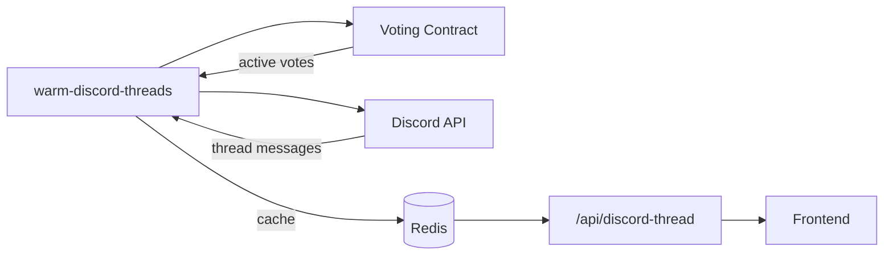
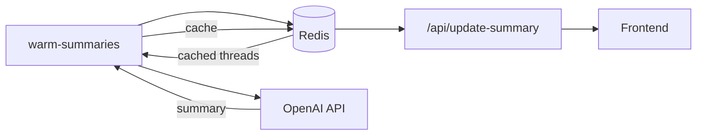

This is a [Next.js](https://nextjs.org/) project bootstrapped with [`create-next-app`](https://github.com/vercel/next.js/tree/canary/packages/create-next-app).

## Getting Started

**Getting your environment variables**
You can only do this if you have access to UMA's vercel projects.

You need to install [vercel-cli](https://vercel.com/docs/cli).

Then run `vercel link`, and follow the prompts to link the UMA->voter-dapp-v2 project.

Once linked run `vercel env pull .env.local`. This will pull a file down which has development environment variables.

Next, run the development server:

```bash
npm run dev
# or
yarn dev
```

## Generating the Approved Identifiers Table

We use a JSON file to look up titles, descriptions and URLs for approved price identifiers for display in the UI. The list of approved identifiers can be found [in our docs](https://docs.uma.xyz/resources/approved-price-identifiers).

These approved identifiers are updated periodically in the docs, and when this happens, the JSON file will need to be re-generated.

To generate the JSON file, run the following command in the root directory of the project:

`yarn update-approved-identifiers`

This will download the raw file of the approved identifiers from the UMA docs (on GitHub), and then re-generate a JSON file.

## Cron Jobs & Discord Integration

The app uses cron jobs (every 10 min) to pre-fetch Discord threads and generate AI summaries.

### 1. Discord Thread Caching

`/api/cron/warm-discord-threads` fetches and caches Discord discussions for active votes.



#### Thread ID Map

To find Discord threads for votes, we maintain a **thread ID map** that maps vote request keys to Discord thread IDs. This map is cached in Redis and refreshed using two strategies:

1. **Incremental updates**: On each cron run, we fetch only new messages (using Discord's `after` parameter) and merge them into the existing map. This is fast and avoids rate limits.

2. **Full rebuilds**: Every **2 hours**, we do a full rebuild to catch any threads that may have been missed due to race conditions or API issues. Full rebuilds only look back **7 days** to avoid fetching ancient history.

The request key format is `{title}-{timestamp}` with spaces removed, e.g., `U.S.strikeonSomaliabyFebruary7?-1770699603`. This key is generated both when looking up threads (from vote metadata) and when parsing Discord thread names.

### 2. AI Summary Generation

`/api/cron/warm-summaries` generates AI summaries from cached thread data (batches of 3).



## Disabling Discord Summaries

To disable specific Discord summaries, set `DISABLED_DISCORD_SUMMARY` with semicolon-separated entries in the format `time:identifier:title`.

**Important**: If titles contain dollar signs (`$`), escape them with backslashes or use single quotes to prevent shell variable expansion.

Examples:
```bash
# Using escaped dollar signs (recommended)
DISABLED_DISCORD_SUMMARY="1756831090:0x5945535F4F525F4E4F5F51554552590000000000000000000000000000000000:WLFI >\$35B market cap (FDV) one day after launch?;1756823752:0x5945535F4F525F4E4F5F51554552590000000000000000000000000000000000:MicroStrategy purchases >4000 BTC September 2-8?"
```